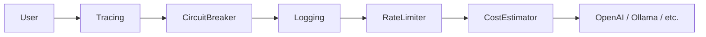

# GoPolyAI

A vendor-agnostic AI gateway and wrapper library for Go. It provides a unified interface for multiple AI providers with a robust middleware pipeline for resiliency, observability, and cost management.

## Features

  * **Unified Interface:** Switch between OpenAI, Anthropic (Claude), Google (Gemini), and Ollama (Local) without changing business logic.
  * **Resilience:** Built-in **Circuit Breaker** and **Retry** with exponential backoff.
  * **Traffic Control:** Token bucket **Rate Limiter**.
  * **Observability:** Structured **Logging**, **Tracing** (UUID), and **Cost Estimation** (USD).
  * **Modes:** Support for Standard Chat, **Streaming**, and **Structured Output** (JSON-to-Struct).

## Installation

```bash
go get github.com/ahmettasdemir/gopolyai
```

## Quick Start (Library)

```go
package main

import (
	"context"
	"fmt"
	"os"

	"github.com/ahmettasdemir/gopolyai/pkg/ai"
	"github.com/ahmettasdemir/gopolyai/pkg/ai/openai"
	"github.com/ahmettasdemir/gopolyai/pkg/ai/middleware"
)

func main() {
	// 1. Initialize Base Provider
	client := openai.NewClient(os.Getenv("OPENAI_API_KEY"))

	// 2. Wrap with Middleware (Optional)
	// Example: Cost Estimator -> Rate Limiter -> Retry -> Base Client
	pricedClient := middleware.NewCostEstimator(client)
	retryClient := middleware.NewResilientClient(pricedClient, middleware.RetryConfig{
		MaxRetries: 3,
	})

	// 3. Generate
	req := ai.ChatRequest{
		Messages: []ai.ChatMessage{{Role: "user", Content: []ai.Content{{Type: "text", Text: "Hello!"}}}},
	}
	
	resp, _ := retryClient.Generate(context.Background(), req)
	fmt.Printf("Response: %s\nCost: $%f\n", resp.Content, resp.Usage.CostUSD)
}
```

## CLI Usage

The project includes a CLI tool for testing providers and middleware chains.

```bash
# Basic Usage
go run ./cmd/gopoly -p openai -k "sk-..." "Explain quantum physics"

# Streaming Mode (-s) with Rate Limit (-rate-limit)
go run ./cmd/gopoly -p ollama -m llama3 -s -rate-limit 5 "Tell me a story"

# Structured Output Mode (-struct)
go run ./cmd/gopoly -p google -k "AIza..." -struct "Extract keywords: Go, AI, Cloud"
```

**Flags:**

  * `-p`: Provider (`openai`, `anthropic`, `google`, `ollama`)
  * `-k`: API Key (or set via env `AI_API_KEY`)
  * `-m`: Model Name (optional override)
  * `-s`: Enable Streaming
  * `-struct`: Enable Structured JSON Output
  * `-rate-limit`: Requests per second (0 = unlimited)

## Supported Providers

| Provider | Package | Env Key |
| :--- | :--- | :--- |
| **OpenAI** | `pkg/ai/openai` | `OPENAI_API_KEY` |
| **Anthropic** | `pkg/ai/anthropic` | `ANTHROPIC_API_KEY` |
| **Google Gemini** | `pkg/ai/google` | `GEMINI_API_KEY` |
| **Ollama** | `pkg/ai/ollama` | N/A (Localhost) |

## Architecture

GoPolyAI uses a decorator pattern (middleware). `AIProvider` interfaces wrap one another to add functionality transparently.



## License

Apache 2.0

-----

**Maintained by [Ahmet Tasdemir](https://www.google.com/search?q=https://github.com/ahmettasdemir)**

-----
