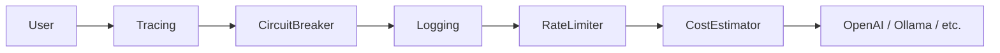

# GoPolyAI

A vendor-agnostic AI gateway and wrapper library for Go. Unifies interactions with OpenAI, Anthropic, Google Gemini, and Ollama under a single interface with a built-in middleware pipeline.

## Features

- **Unified Interface:** Switch providers without changing business logic.
- **Resilience:** Circuit Breaker and Exponential Backoff Retry.
- **Traffic Control:** Token bucket Rate Limiter.
- **Observability:** Structured Logging, Distributed Tracing (UUID), and Cost Estimation.
- **Structured Output:** Type-safe conversion from LLM text to Go Structs.

## Installation

```bash
go get github.com/ahmettasdemir/gopolyai
````

## Usage

### 1\. Basic Chat

```go
package main

import (
	"context"
	"fmt"
	"os"

	"github.com/ahmettasdemir/gopolyai/pkg/ai"
	"github.com/ahmettasdemir/gopolyai/pkg/ai/openai"
)

func main() {
	client := openai.NewClient(os.Getenv("OPENAI_API_KEY"))

	req := ai.ChatRequest{
		Messages: []ai.ChatMessage{{Role: "user", Content: []ai.Content{{Type: "text", Text: "Hello!"}}}},
	}
	
	resp, _ := client.Generate(context.Background(), req)
	fmt.Println(resp.Content)
}
```

### 2\. Advanced Middleware Pipeline

Construct a production-ready pipeline with resilience, logging, and tracing.

```go
// Order: Tracing -> CircuitBreaker -> Logging -> Retry -> RateLimit -> Cost -> Provider
func main() {
	base := openai.NewClient(os.Getenv("OPENAI_API_KEY"))

	// Inner Layer: Cost & Traffic Control
	pipeline := middleware.NewCostEstimator(base)
	pipeline = middleware.NewRateLimiterMiddleware(pipeline, 10, 10) // 10 req/s
	
	// Middle Layer: Resilience
	pipeline = middleware.NewResilientClient(pipeline, middleware.RetryConfig{MaxRetries: 3})

	// Outer Layer: Observability & Safety
	pipeline = middleware.NewLoggingMiddleware(pipeline, &MyLogger{}, config)
	pipeline = middleware.NewCircuitBreaker(pipeline, 3, 30*time.Second)
	finalClient := middleware.NewTracingMiddleware(pipeline)

	resp, err := finalClient.Generate(ctx, req)
}
```

### 3\. Structured Output (JSON-to-Struct)

Force the LLM to return data matching your Go struct definition.

```go
type SentimentAnalysis struct {
    Score    int      `json:"score" description:"Score between 1-10"`
    Keywords []string `json:"keywords"`
    Summary  string   `json:"summary"`
}

var result SentimentAnalysis
// Automatically generates schema, injects prompt, and unmarshals response
err := ai.GenerateStruct(ctx, client, req, &result)

fmt.Printf("Score: %d | Summary: %s", result.Score, result.Summary)
```

## CLI Usage

Test providers and configurations directly from the terminal.

```bash
# Basic Usage
go run ./cmd/gopoly -p openai -k "sk-..." "Explain quantum physics"

# Streaming Mode with Rate Limit
go run ./cmd/gopoly -p ollama -m llama3 -s -rate-limit 5 "Tell me a story"

# Structured Output Mode
go run ./cmd/gopoly -p google -k "AIza..." -struct "Extract keywords: Go, AI, Cloud"
```

**Flags:**

  - `-p`: Provider (`openai`, `anthropic`, `google`, `ollama`)
  - `-k`: API Key (or set via `AI_API_KEY`)
  - `-m`: Model Name (optional)
  - `-s`: Enable Streaming
  - `-struct`: Enable Structured JSON Output
  - `-rate-limit`: Requests per second (0 = unlimited)

## Supported Providers

| Provider | Package | Env Key |
|----------|---------|---------|
| **OpenAI** | `pkg/ai/openai` | `OPENAI_API_KEY` |
| **Anthropic** | `pkg/ai/anthropic` | `ANTHROPIC_API_KEY` |
| **Google Gemini** | `pkg/ai/google` | `GEMINI_API_KEY` |
| **Ollama** | `pkg/ai/ollama` | N/A (Localhost) |

## Architecture

GoPolyAI uses a decorator pattern (middleware). `AIProvider` interfaces wrap one another to add functionality transparently.



## License

Apache 2.0

-----

**Maintained by [Ahmet Tasdemir](https://www.google.com/search?q=https://github.com/ahmettasdemir)**

-----
